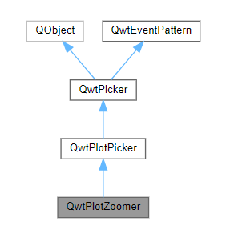

# Today's Qwt Notebook
## What is Stack Zooming?
It's a concept realting to how **zoom states** are managed in some interactive plotting tools, including **QwtPlotZoomer**.
When you zoom in (e.g., by drawing a rectangle), the plot records the current view as a **zoom level** or **zoom state**.
These states are stored in a **stack** data structure — think of it like a pile of zoom **“snapshots.”**
- Each new zoom action **pushes** a new zoom rectangle onto the stack.
- When you zoom out (usually by right-click or a “zoom out” command), the zoomer **pops** the top zoom rectangle off the stack, returning to the previous zoom level.
## How does zooming work in Qwt?
### QwtPlotZoomer
**QwtPlotZoomer** provides **stacked zooming** for a plot widget.
<figure>
  
  <figcaption>Inheritance diagram for QwtPlotZoomer</figcaption>
</figure>
